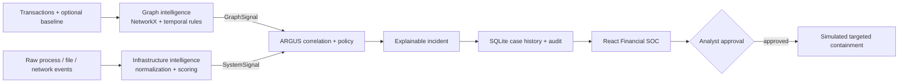

# ARGUS — Cross-Domain Financial Threat Intelligence

[](https://github.com/pratyushdeosingh/ARGUS_CSI/actions/workflows/ci.yml)

ARGUS is a Financial Security Operations Center that detects when suspicious money movement and compromised payment infrastructure are part of the same attack. It analyzes arbitrary transaction batches, learns a caller-supplied behavioral baseline, evaluates raw host telemetry, correlates independent evidence, creates a durable incident, and keeps high-impact containment behind analyst approval.

This is not a dashboard wrapped around one hard-coded scenario. The canonical demo is only a safe presentation path. Open **DATA LAB** to edit or paste completely different transaction, baseline, and telemetry JSON and generate content-derived signals, incident IDs, evidence, actions, metrics, and history.

> **Safety boundary:** all bundled identities and events are synthetic. Response actions are simulated. Do not connect this prototype directly to production accounts, secrets, infrastructure, or enforcement controls.

## The problem

A fraud team may see an account suddenly disperse funds through mule accounts. At the same moment, an infrastructure team may see the payment worker spawn a shell, access a sensitive path, and contact a suspicious destination. In separate queues, both alerts are noisy. Together, they describe a coordinated account-takeover and payment-service compromise.

ARGUS joins those worlds and answers four questions an analyst actually cares about:

1. **What happened?** An explainable graph and temporal detector identifies identity changes, amount anomalies, beneficiary novelty, velocity, multi-hop movement, forwarded funds, and fan-in/fan-out.
2. **Was the payment system involved?** Process, file, and network telemetry is normalized into a second independent risk signal.
3. **Do the signals belong to the same attack?** ARGUS evaluates time proximity, shared network indicators, and both risk scores.
4. **What should happen next?** A severity-aware policy recommends monitoring or targeted simulated containment, requiring human approval for high-impact actions.

## What makes it different

- **Arbitrary data, not fixture substitution.** `POST /api/analyze` accepts 1–5,000 caller transactions, an optional behavioral baseline, and optional raw telemetry. Arbitrary analysis fails visibly if a required detector cannot process the data; it never silently swaps in the canonical fixture.
- **Adaptive baseline.** The graph detector can replace its reference window at runtime, allowing the same engine to reason about different customers, devices, beneficiaries, currencies, and spending patterns.
- **Cross-domain correlation.** Financial and infrastructure evidence is combined using transparent scoring and graded time/IP bonuses.
- **Content-derived identity.** Analysis, graph signal, system signal, and incident IDs are hashes of their inputs, making runs reproducible without pretending every event is `INC-001`.
- **Durable case memory.** Transactions, signals, incidents, approvals, and audit records are stored in SQLite and survive backend restarts. Docker mounts the database in a named volume.
- **Human-governed response.** Informational and suspicious results remain under monitoring; high and critical incidents can recommend account freeze, transfer cancellation, or service isolation, but execution requires an analyst.
- **Visible provenance.** The dashboard distinguishes live/replay service output, last-known signals, fixtures, degraded services, and unavailable detectors.
- **Safe eBPF story.** The system supports deterministic replay everywhere and a deliberately constrained bpftrace collector on a privileged Linux host.

## Architecture



All detector boundaries use typed Pydantic models and the shared JSON schemas in [`contracts/`](contracts/). The browser talks only to the ARGUS backend; detector orchestration, fallback policy, persistence, and approval logic remain server-side.

| Component | Responsibility | Technology | Port |
|---|---|---|---:|
| ARGUS core | Analysis orchestration, correlation, policy, persistence, metrics, incident approval, audit | FastAPI + SQLite + HTTPX | `8000` |
| Graph detector | Behavioral baseline and explainable transaction graph/temporal risk | FastAPI + NetworkX | `8001` |
| Infrastructure detector | Replay/live collection, raw telemetry normalization, host risk | FastAPI + bpftrace/replay | `8002` |
| Financial SOC | Data Lab, graph visualization, evidence, provenance, response, history | React + TypeScript + Cytoscape | `5173` |

## How detection works

### Financial intelligence

The graph detector builds a directed account network and evaluates seven observable features:

| Feature | Weight | Example |
|---|---:|---|
| Rapid multi-hop path | `0.30` | Funds move across multiple accounts in a short window |
| Funds forwarded | `0.18` | A beneficiary quickly becomes a sender |
| Unusual amount | `0.17` | Current value departs sharply from the supplied baseline |
| Identity change | `0.10` | New device or IP appears for an established account |
| Velocity | `0.10` | Transfers cluster unusually tightly in time |
| New beneficiary | `0.08` | Destination is absent from historical behavior |
| Fan-in/fan-out | `0.07` | One account rapidly distributes to or aggregates from many peers |

Independent findings receive a small corroboration bonus, capped at `0.08`. The result includes the anomaly type, risk, suspicious accounts and transactions, related IPs, and plain-language reasons.

### Infrastructure intelligence

Raw events are normalized into process, file, and network categories. Suspicious categories contribute once, preventing duplicate-event inflation:

```text
host risk = 0.03 baseline
          + 0.26 suspicious process behavior
          + 0.26 suspicious file behavior
          + 0.32 suspicious network behavior
```

The caller's actual destination IP, host, service, and process are preserved in the signal. Replay and live collection produce the same contract.

### Correlation and decision policy

```text
confidence = 0.50 × graph risk
           + 0.35 × infrastructure risk
           + up to 0.15 shared-evidence bonus
```

The bonus is based on signal proximity within a 15-minute correlation window and shared IP evidence. Verdicts, summaries, affected accounts, evidence, and actions are derived from the signals.

| Confidence | Severity | Initial state |
|---:|---|---|
| `≥ 0.85` | Critical | Awaiting analyst approval |
| `≥ 0.70` | High | Awaiting analyst approval |
| `≥ 0.40` | Suspicious | Monitoring |
| `< 0.40` | Informational | Monitoring |

## Quick start — Docker

Docker Compose is the easiest four-service setup. It uses safe replay telemetry and persists ARGUS history in the `argus-runtime` volume.

### Prerequisites

- Git
- Docker Desktop or Docker Engine with Compose v2

```bash
git clone https://github.com/pratyushdeosingh/ARGUS_CSI.git
cd ARGUS_CSI
docker compose up --build
```

Open these pages:

| What to inspect | URL |
|---|---|
| Financial SOC dashboard and Data Lab | [http://127.0.0.1:5173](http://127.0.0.1:5173) |
| ARGUS API and arbitrary-analysis contract | [http://127.0.0.1:8000/docs](http://127.0.0.1:8000/docs) |
| Graph detector API and adaptive baseline | [http://127.0.0.1:8001/docs](http://127.0.0.1:8001/docs) |
| Infrastructure detector and telemetry endpoint | [http://127.0.0.1:8002/docs](http://127.0.0.1:8002/docs) |

Stop with `Ctrl+C`, then run `docker compose down`. Add `-v` only when you intentionally want to delete persisted ARGUS history.

## Two ways to demonstrate it

### 1. Polished 90-second story

1. Wait for **SYSTEM OPERATIONAL**.
2. Select **CANONICAL DEMO** and follow the staged attack timeline.
3. Compare financial and host findings, then inspect shared evidence in the ARGUS verdict.
4. Select **APPROVE CONTAINMENT** and verify that every action appears in the audit trail.

### 2. Prove it is not hard-coded

1. Select **DATA LAB**.
2. Try **Adaptive account takeover**, **Structuring fan-out**, and **Clean control batch**. They use different accounts, topologies, devices, IPs, hosts, services, and outcomes.
3. Edit any JSON field—or paste your own arrays—and run cross-domain analysis.
4. Verify that graph nodes, scores, timeline, signal IDs, incident ID, evidence, recommended actions, metrics, and history change with the input.
5. Restart the backend and confirm the incident remains in persistent history.

The Data Lab starter data is intentionally synthetic and fully editable; it is not a claim of production fraud accuracy.

## Run locally without Docker

Python 3.11+ and Node.js 22+ are recommended. From the repository root:

```powershell
py -3.11 -m venv .venv
.\.venv\Scripts\Activate.ps1
python -m pip install -r backend/requirements.txt
python -m pip install -r services/graph-detector/requirements.txt
python -m pip install -r services/ebpf-detector/requirements.txt
corepack enable
pnpm --dir frontend install --frozen-lockfile
```

Start one process per terminal:

```powershell
# Terminal 1 — graph detector
python -m uvicorn app:app --app-dir services/graph-detector --host 127.0.0.1 --port 8001
```

```powershell
# Terminal 2 — portable infrastructure replay detector
$env:ARGUS_EBPF_MODE = "replay"
python -m uvicorn api:app --app-dir services/ebpf-detector --host 127.0.0.1 --port 8002
```

```powershell
# Terminal 3 — ARGUS core; no silent fixture fallback
$env:ARGUS_DETECTOR_MODE = "required"
$env:GRAPH_DETECTOR_URL = "http://127.0.0.1:8001"
$env:EBPF_DETECTOR_URL = "http://127.0.0.1:8002"
$env:ARGUS_DB_PATH = "data/argus.db"
python -m uvicorn backend.app.main:app --host 127.0.0.1 --port 8000
```

```powershell
# Terminal 4 — dashboard
pnpm --dir frontend dev --host 127.0.0.1
```

On macOS/Linux, activate with `source .venv/bin/activate`, use `python3` if required, and set variables with `export NAME=value`.

## API surface

| Method | Endpoint | Purpose |
|---|---|---|
| `POST` | `/api/analyze` | Analyze arbitrary transactions, optional baseline, and telemetry; optionally correlate |
| `GET` | `/api/platform/metrics` | Data-derived transaction, signal, account, value, confidence, and severity metrics |
| `GET` | `/api/incidents` | List durable incident history |
| `GET` | `/api/incidents/{id}` | Retrieve one incident |
| `POST` | `/api/incidents/{id}/approve` | Execute that incident's approved simulated actions |
| `GET` | `/api/audit?incident_id=...` | Retrieve persistent action history |
| `GET` | `/api/detectors/status` | Report detector availability and provenance |
| `POST` | `/api/signals/correlate` | Correlate caller-supplied contract-valid signals |
| `GET` | `/api/demo/normal` | Return the canonical healthy presentation state |
| `POST` | `/api/demo/simulate-attack` | Run the canonical integrated presentation path |

Detector-specific additions:

- Graph: `GET /baseline`, `POST /baseline/train`, `POST /analyze`, `POST /analyze-context` (atomic request-scoped baseline)
- Infrastructure: `POST /analyze-events`, `POST /simulate`, `GET /signals/latest`

Interactive request schemas and examples are available in each service's `/docs` page. Detailed integration behavior is in [`docs/integration.md`](docs/integration.md).

## Runtime configuration

Copy [`.env.example`](.env.example) for local overrides.

| Variable | Default / values | Purpose |
|---|---|---|
| `ARGUS_DETECTOR_MODE` | `auto`, `fixture`, `required` | Choose visible fallback behavior or strict service integration |
| `GRAPH_DETECTOR_URL` | `http://127.0.0.1:8001` | Graph service base URL |
| `EBPF_DETECTOR_URL` | `http://127.0.0.1:8002` | Infrastructure service base URL |
| `DETECTOR_TIMEOUT_SECONDS` | `2.5` | Per-service HTTP timeout |
| `ARGUS_DB_PATH` | `data/argus.db` | Durable SQLite database path |
| `ARGUS_EBPF_MODE` | `auto`, `replay`, `live` | Portable replay or strict Linux capture |
| `ARGUS_GRAPH_BASELINE` | bundled healthy fixture | Initial graph baseline; Data Lab can retrain it at runtime |
| `VITE_API_BASE_URL` | `http://127.0.0.1:8000` | Browser-facing ARGUS core URL |

`fixture` mode exists for an offline presentation. The UI labels it explicitly. Use `required` when proving real service integration because it returns an error instead of hiding a detector failure.

## Verification

Run every repository check:

```powershell
python -m pytest -q
pnpm --dir frontend test
pnpm --dir frontend build
```

With both detector services running, also execute:

```powershell
python -m backend.app.integration_check
```

Current verified baseline:

- Python: **38 passed**, **1 skipped** (the privileged live-eBPF test is opt-in on Linux)
- Frontend: **4 passed**
- TypeScript and production Vite build: **passed**
- Arbitrary transaction + baseline + telemetry API integration: **covered**
- SQLite persistence and data-derived platform metrics: **covered**

GitHub Actions repeats Python tests, frontend tests, and the production build on every pull request and push to `main`.

## Repository map

```text
backend/                      Orchestration, correlation, policy, persistence, API
contracts/                    Shared JSON signal and entity contracts
data/normal/                  Initial healthy reference data
data/attack/                  Canonical safe replay fixtures
docs/                         Architecture, integration, demo, release checklist
frontend/                     React Financial SOC and editable Intelligence Lab
services/graph-detector/      Adaptive graph and temporal financial analysis
services/ebpf-detector/       Raw telemetry analysis plus safe replay/live capture
docker-compose.yml            Health-checked four-service stack + persistent volume
pytest.ini                    Integrated Python test discovery
```

## Team ownership

| Contributor | Primary ownership | Integrated result |
|---|---|---|
| Pratyush | ARGUS core, dashboard, integration | Cross-service orchestration, response policy, persistent cases, analyst experience |
| Pratham | Graph detector | Adaptive behavioral baseline, graph/temporal features, explainable financial signal |
| Nitin | Infrastructure detector | Safe bpftrace collector, replay, arbitrary telemetry normalization and scoring |

The product value comes from the integration: neither detector alone declares a coordinated incident, and the UI never bypasses the core policy layer.

## Safety, provenance, and honest limitations

- Bundled data is synthetic; Data Lab inputs should also be non-sensitive.
- SQLite provides strong hackathon/demo durability, not a production multi-region case store.
- The rule weights are transparent and deterministic; they require validation and calibration on representative, legally usable data before real deployment.
- Docker uses replay mode because live eBPF requires Linux, `bpftrace`, and elevated privileges.
- The live collector observes the bundled harmless worker and does not read file contents or contact a suspicious IP.
- Containment is simulated. Production use would require authenticated operators, fine-grained authorization, signed integrations, idempotency, rollback, and regulatory review.
- This prototype demonstrates cross-domain reasoning and human governance; it does not claim to replace bank fraud, SIEM, or incident-response platforms.

For guarded live Linux collection, read [`services/ebpf-detector/SETUP_LINUX.md`](services/ebpf-detector/SETUP_LINUX.md). Before a presentation, use [`docs/release-checklist.md`](docs/release-checklist.md) and [`docs/demo-script.md`](docs/demo-script.md).

congrats you read the whole readme -Nitin
