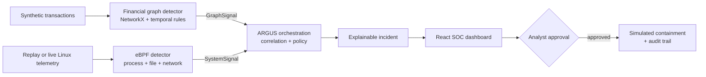

# ARGUS — Autonomous Financial Threat Response

[](https://github.com/pratyushdeosingh/ARGUS_CSI/actions/workflows/ci.yml)

ARGUS is an explainable, human-governed **Financial Security Operations Center (Financial SOC)** prototype. It detects a coordinated financial attack by correlating two views that are usually investigated separately:

- suspicious movement of money across an account graph; and
- suspicious process, file, and network activity inside payment infrastructure.

ARGUS turns those signals into one evidence-backed incident, recommends containment, and keeps every critical action behind explicit analyst approval. The entire demo uses synthetic data and simulated response actions, so it is safe and deterministic for a hackathon environment.

> **Safety boundary:** ARGUS is not a banking system. Do not connect it to real accounts, production infrastructure, secrets, or enforcement controls.

## Why ARGUS matters

Transaction monitoring can identify an unusual transfer, while infrastructure monitoring can identify a compromised payment process. Either alert alone can be noisy. ARGUS raises confidence only when independent evidence agrees—for example, when both detectors observe `185.220.101.10` within the same short time window.

The result is a clear story an analyst can verify:

1. `ACC-101` appears from a new device and suspicious IP.
2. ₹85,000 rapidly moves through three mule accounts.
3. The payment service exhibits suspicious process, fake-sensitive-file, and network activity.
4. ARGUS links the shared IP and timestamps into critical incident `INC-001`.
5. An analyst approves simulated account freeze, transfer cancellation, and service isolation.
6. Every action is recorded in an audit trail.

## Architecture



All services exchange strict JSON contracts from [`contracts/`](contracts/). The dashboard talks only to the orchestration API; it never bypasses the decision and policy layer to call detectors directly.

| Component | Responsibility | Runtime | Port |
|---|---|---|---|
| ARGUS backend | Collects signals, correlates evidence, applies approval policy, records audit events | FastAPI | `8000` |
| Graph detector | Finds identity changes, unusual amounts, new beneficiaries, velocity, temporal mule paths, forwarded funds, and fan-in/fan-out | FastAPI + NetworkX | `8001` |
| eBPF detector | Converts safe process, file, and network observations into infrastructure risk; supports portable replay and live Linux capture | FastAPI + bpftrace/replay | `8002` |
| SOC dashboard | Visualizes attack progression, transaction graph, detector provenance, incident evidence, containment, and audit history | React + Vite | `5173` |

## Detection and correlation

### Financial graph signal

The graph detector compares the transaction batch with an immutable healthy baseline and emits a deterministic `GraphSignal`. The canonical healthy fixture scores `0.000`; the attack fixture scores `0.898` and identifies the complete `ACC-101 → ACC-202 → ACC-303 → ACC-404` chain.

### Infrastructure signal

The eBPF detector normalizes three safe evidence categories:

- an unexpected child process;
- access to a dedicated fake configuration file; and
- a controlled connection mapped to the canonical threat-intelligence IP.

Normal replay scores `0.03`; attack replay scores `0.87`. Replay and live Linux collection produce the same `SystemSignal` contract, and the dashboard always displays the true source mode.

### Explainable decision

ARGUS uses a transparent score instead of an opaque model:

```text
confidence = 0.50 × graph risk
           + 0.35 × infrastructure risk
           + up to 0.15 shared-evidence bonus
```

The canonical integrated run produces `0.904` confidence: a critical incident awaiting approval. Shared IP evidence contributes `0.10`; signals within five minutes contribute `0.05`.

| Confidence | Severity | Initial response state |
|---:|---|---|
| `≥ 0.85` | Critical | Awaiting analyst approval |
| `≥ 0.70` | High | Awaiting analyst approval |
| `≥ 0.40` | Suspicious | Monitoring |
| `< 0.40` | Informational | Monitoring |

## Quick start with Docker

This is the recommended hackathon setup. It launches all four components, waits for detector health checks, and runs the eBPF service in deterministic replay mode.

### Prerequisites

- Git
- Docker Desktop or Docker Engine with Docker Compose v2

```bash
git clone https://github.com/pratyushdeosingh/ARGUS_CSI.git
cd ARGUS_CSI
docker compose up --build
```

Open [http://127.0.0.1:5173](http://127.0.0.1:5173), wait for **SYSTEM OPERATIONAL**, and select **SIMULATE ATTACK**.

Useful service URLs:

- Dashboard: [http://127.0.0.1:5173](http://127.0.0.1:5173)
- ARGUS API docs: [http://127.0.0.1:8000/docs](http://127.0.0.1:8000/docs)
- Graph detector docs: [http://127.0.0.1:8001/docs](http://127.0.0.1:8001/docs)
- eBPF detector docs: [http://127.0.0.1:8002/docs](http://127.0.0.1:8002/docs)

Stop the stack with `Ctrl+C`, then run `docker compose down`.

## Run locally without Docker

Python 3.11+ and Node.js 22+ are recommended. The commands below use PowerShell from the repository root.

### 1. Install dependencies

```powershell
py -3.11 -m venv .venv
.\.venv\Scripts\Activate.ps1
python -m pip install -r backend/requirements.txt
python -m pip install -r services/graph-detector/requirements.txt
python -m pip install -r services/ebpf-detector/requirements.txt
corepack enable
pnpm --dir frontend install --frozen-lockfile
```

### 2. Start each service

Open four terminals and activate the virtual environment in the first three.

```powershell
# Terminal 1 — financial graph detector
python -m uvicorn app:app --app-dir services/graph-detector --host 127.0.0.1 --port 8001
```

```powershell
# Terminal 2 — portable eBPF replay detector
$env:ARGUS_EBPF_MODE = "replay"
python -m uvicorn api:app --app-dir services/ebpf-detector --host 127.0.0.1 --port 8002
```

```powershell
# Terminal 3 — orchestration; fail visibly if either detector is unavailable
$env:ARGUS_DETECTOR_MODE = "required"
$env:GRAPH_DETECTOR_URL = "http://127.0.0.1:8001"
$env:EBPF_DETECTOR_URL = "http://127.0.0.1:8002"
python -m uvicorn backend.app.main:app --host 127.0.0.1 --port 8000
```

```powershell
# Terminal 4 — dashboard
pnpm --dir frontend dev
```

On macOS/Linux, activate with `source .venv/bin/activate`, use `python3` where needed, and set variables with `export NAME=value`.

### Offline fallback

Set `ARGUS_DETECTOR_MODE=fixture` to run the backend and dashboard without either detector. Fixture origin is visible in the UI, so the demo never presents fallback data as a live service result.

## Demo walkthrough

1. Confirm both detector cards report service availability; `REPLAY SERVICE` is expected for eBPF under Docker.
2. Click **SIMULATE ATTACK**.
3. Follow the new-device event and rapid mule transfers on the timeline and graph.
4. Compare the independent financial and infrastructure findings.
5. Inspect the critical ARGUS verdict and its shared IP/time evidence.
6. Click **APPROVE CONTAINMENT**.
7. Confirm all three simulated actions complete and appear in the audit trail.

The full presentation narrative is in [`docs/demo-script.md`](docs/demo-script.md).

## API overview

| Method | Endpoint | Purpose |
|---|---|---|
| `GET` | `/health` | Backend liveness |
| `GET` | `/api/demo/normal` | Reset the demo to its healthy state |
| `GET` | `/api/detectors/status` | Report availability, source, and live/replay/fixture provenance |
| `POST` | `/api/demo/simulate-attack` | Collect both detector signals and create the incident |
| `POST` | `/api/signals/correlate` | Correlate supplied contract-valid signals |
| `POST` | `/api/incidents/{id}/approve` | Execute approved simulated actions |
| `GET` | `/api/audit` | Return the containment audit trail |

Detector interfaces and payload rules are documented in [`docs/integration.md`](docs/integration.md).

## Configuration

Copy [`.env.example`](.env.example) when you need local overrides.

| Variable | Values/default | Purpose |
|---|---|---|
| `ARGUS_DETECTOR_MODE` | `auto`, `fixture`, `required` | Prefer services with fallback, force fixtures, or fail if integration is unavailable |
| `GRAPH_DETECTOR_URL` | `http://127.0.0.1:8001` | Graph service base URL |
| `EBPF_DETECTOR_URL` | `http://127.0.0.1:8002` | eBPF service base URL |
| `DETECTOR_TIMEOUT_SECONDS` | `2.5` | Per-service HTTP timeout |
| `ARGUS_EBPF_MODE` | `auto`, `replay`, `live` | Choose portable replay or strict Linux collection |
| `ARGUS_GRAPH_BASELINE` | Canonical normal fixture | Optional alternate synthetic baseline |
| `VITE_API_BASE_URL` | `http://127.0.0.1:8000` | Browser-facing orchestration URL |

## Verification

Run the complete repository checks from the root:

```powershell
python -m pytest -q
pnpm --dir frontend test
pnpm --dir frontend build
```

With both detector services running, verify real HTTP collection and contract validation:

```powershell
python -m backend.app.integration_check
```

The verified integrated baseline is:

- Python: **32 passed**, with **1 live-eBPF test intentionally skipped** unless explicitly enabled on a privileged Linux host;
- Frontend: **4 passed**; and
- Production frontend build: successful, with Cytoscape split into a lazy-loaded visualization chunk.

GitHub Actions repeats the Python tests, frontend tests, and production build for every pull request and push to `main`.

## Repository map

```text
backend/                      ARGUS correlation, policy, API, and tests
contracts/                    Authoritative JSON Schemas
data/normal/                  Healthy behavioral baseline
data/attack/                  Canonical attack and replay fixtures
docs/                         Architecture, integration, demo, release checklist
frontend/                     React/Vite SOC dashboard
services/graph-detector/      Explainable temporal financial graph analysis
services/ebpf-detector/       Safe live/replay infrastructure telemetry
docker-compose.yml            Full four-component demo stack
pytest.ini                    Integrated Python test discovery
```

## Team contributions

| Contributor | Primary ownership | Outcome |
|---|---|---|
| Pratyush | `backend/`, `frontend/`, integration | Orchestration, policy, detector gateway, dashboard, and end-to-end flow |
| Pratham | `services/graph-detector/` | Deterministic graph risk engine, visualization output, contracts, and tests |
| Nitin | `services/ebpf-detector/` | Safe bpftrace collector, replay mode, normalization, scoring, API, and tests |

## Safety, provenance, and limitations

- All account, transaction, host, process, file, and IP data is synthetic.
- Docker uses replay mode because live eBPF requires a Linux kernel, `bpftrace`, and root privileges.
- The live collector observes only the bundled harmless `payment-worker`; it does not read file contents or contact the suspicious IP.
- The backend stores demo state in memory; restarting it resets incidents and audit events.
- Containment is simulated. No real account freeze, transfer cancellation, or service isolation occurs.
- Detector fallback is explicit: the UI distinguishes service, last-known, fixture, and unavailable states.

For privileged Linux setup and safeguards, read [`services/ebpf-detector/SETUP_LINUX.md`](services/ebpf-detector/SETUP_LINUX.md). For the final pre-demo gate, use [`docs/release-checklist.md`](docs/release-checklist.md).
